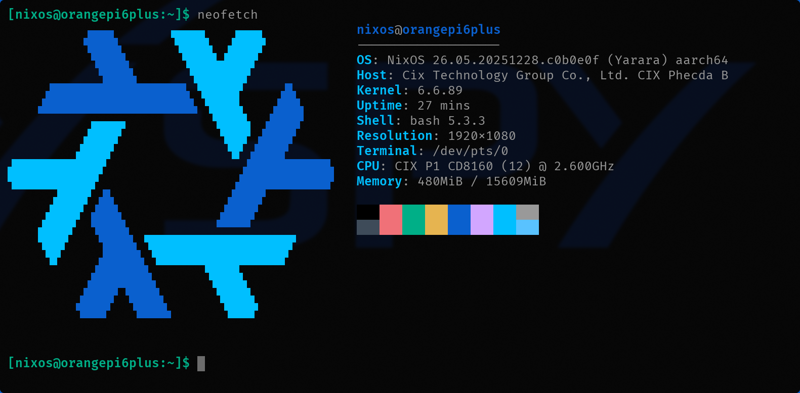

# NixOS for CIX CD8180/CD8160 SoC (Sky1)

[](https://github.com/i-am-logger/nixos-cix-cd8180/actions/workflows/build.yml)
[](https://github.com/i-am-logger/nixos-cix-cd8180/actions/workflows/auto-update.yml)  
[](https://i-am-logger.cachix.org)
[](https://nixos.org)
[](https://creativecommons.org/licenses/by-nc-sa/4.0/)

**Pre-built Images**: [Latest Release](https://github.com/i-am-logger/nixos-cix-cd8180/releases/latest) - SD Card Image, Netboot (kernel + initrd + iPXE)

> ⚠️ Work in progress, use at your own risk...

NixOS flake for CIX CD8180/CD8160 (Sky1) based single-board computers.

- **Kernel**: Linux 6.6.89-sky1 (vendor)
- **Drivers**: GPU, NPU, ISP, VPU (proprietary)
- **Firmware**: Pre-packaged for all hardware
- **Tools**: Board-specific configuration utilities



*NixOS 26.05 running on Orange Pi 6 Plus with HDMI console (1920x1080)*

## Supported Boards

| Board | SD Card | NVMe | PXE | Documentation |
|-------|---------|------|-----|---------------|
| Orange Pi 6 Plus | ✅ Tested | ⚠️ Untested | ✅ Building | [docs](docs/boards/orangepi-6-plus.md) |
| Radxa Orion O6 | ⚠️ Planned | ⚠️ Planned | ⚠️ Planned | - |

## Documentation

- **[CIX CD8180/CD8160 SoC](docs/cix-cd8180-cd8160.md)** - Kernel, drivers, firmware, hardware specs
- **[Installation Guide](docs/installation.md)** - SD Card, NVMe, Network Boot
- **[Development Guide](docs/development.md)** - Building, testing, CI/CD
- **[Example Configurations](examples/)** - Minimal, desktop, AI/ML workstation

## Vendor Repositories

- **Kernel**: [orangepi-xunlong/linux-orangepi](https://github.com/orangepi-xunlong/linux-orangepi) (branch: `orange-pi-6.1-cix`)
- **Drivers/Firmware**: [orangepi-xunlong/component_cix-current](https://github.com/orangepi-xunlong/component_cix-current)
- **Build System/Tools**: [orangepi-xunlong/orangepi-build](https://github.com/orangepi-xunlong/orangepi-build) (includes orangepi-config)

## Acknowledgments

Inspired by and learned from:

- **[gnull/nixos-rk3588](https://github.com/gnull/nixos-rk3588)** - Kernel packaging, cross-compilation, module structure
- **[ryan4yin/nixos-rk3588](https://github.com/ryan4yin/nixos-rk3588)** (archived) - Initial flake structure
- [aciceri/rock5b-nixos](https://github.com/aciceri/rock5b-nixos)
- [nabam/nixos-rockchip](https://github.com/nabam/nixos-rockchip)

Thanks to the [NixOS on ARM Matrix group](https://matrix.to/#/#nixos-on-arm:nixos.org)

## Development

See [Development Guide](docs/development.md) for building, testing, and contributing.

Quick start:
```bash
nix flake check  # Validate flake
nix flake show   # Show available packages
nix develop      # Enter development shell
```

## Contributing

We welcome contributions! See [.github/CONTRIBUTING.md](.github/CONTRIBUTING.md) for:
- How to contribute
- Code guidelines
- Testing requirements
- Pull request process

**Areas needing help:**
- Hardware testing on Orange Pi 6 Plus
- Support for Radxa Orion O6
- Driver testing and documentation

## License

**Creative Commons Attribution-NonCommercial-ShareAlike 4.0 International (CC BY-NC-SA 4.0)**

See [LICENSE](./LICENSE) for details.

---

**Status**: ✅ Tested on Orange Pi 6 Plus | Community contributions welcome
