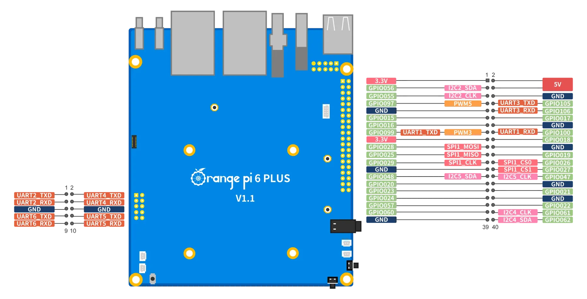

# Orange Pi 6 Plus

Board-specific documentation for Orange Pi 6 Plus (CIX CD8180/CD8160 SoC).

**SoC Documentation**: See [CIX CD8180/CD8160](../cix-cd8180-cd8160.md) for kernel, drivers, firmware, and hardware specifications.

## Quick Start

**Build SD Card Image:**
```bash
# Cross-compile from x86_64 (recommended, first build ~35-40 min)
nix build .#orangepi6plus-sdImage-cross --print-build-logs

# Native build on aarch64
nix build .#orangepi6plus-sdImage --print-build-logs
```

**Flash to SD Card:**
```bash
zstd -d result/sd-image/*.img.zst
sudo dd if=result/sd-image/*.img of=/dev/sdX bs=4M status=progress conv=fsync
```

See [Installation Methods](#installation-methods) below for NVMe and Network Boot options.

---

## Board Overview

- **SoC**: CIX CD8180/CD8160 (Sky1)
- **RAM**: 4GB / 8GB / 16GB LPDDR5
- **Storage**: MicroSD, NVMe M.2 2280
- **Network**: Realtek RTL8126 2.5GbE
- **USB**: 1x USB 3.0, 2x USB 2.0
- **Video**: HDMI 2.1 (4K@60Hz)
- **GPIO**: 40-pin header
- **Power**: USB-C PD, 5V/4A
- **Boot**: UEFI firmware (pre-installed)

## Board-Specific Components

### SD Card Image

**Build Commands:**

```bash
# Cross-compile from x86_64 (recommended)
nix build .#orangepi6plus-sdImage-cross

# Native build on aarch64
nix build .#orangepi6plus-sdImage

# With build logs
nix build .#orangepi6plus-sdImage-cross --print-build-logs
```

**Output**: `result/sd-image/nixos-sd-image-*.img.zst`

### Network Boot (Netboot)

**Build Commands:**

```bash
# Cross-compile from x86_64 (recommended)
nix build .#orangepi6plus-netboot-cross

# Native build on aarch64
nix build .#orangepi6plus-netboot

# With build logs
nix build .#orangepi6plus-netboot-cross --print-build-logs
```

**Output**: `result/{kernel,initrd,netboot.ipxe}`

### Board Tools

**Build Commands:**

```bash
# Cross-compile from x86_64 (recommended)
nix build .#orangepi6plus-tools-cross

# Native build on aarch64
nix build .#orangepi6plus-tools
```

**Included Tools:**
- `orangepi-config` - Hardware configuration utility
- `wiringop` - GPIO library and utilities

## Installation Methods

### Method 1: SD Card Boot

See [Installation Guide - SD Card](../installation.md#option-1-sd-card-boot) for detailed steps.

**Quick Start:**

```bash
# Build image
nix build .#orangepi6plus-sdImage-cross

# Flash to SD card
zstd -d result/sd-image/*.img.zst
sudo dd if=result/sd-image/*.img of=/dev/sdX bs=4M status=progress conv=fsync
```

### Method 2: NVMe SSD Boot

See [Installation Guide - NVMe](../installation.md#option-2-boot-from-nvme-ssd) for detailed steps.

**Requirements:**
- Initial SD card boot
- NVMe M.2 SSD installed
- UEFI firmware (pre-installed)

### Method 3: Network Boot (PXE)

See [Installation Guide - Netboot](../installation.md#option-3-network-boot-pxe) for detailed steps.

**Quick Start:**

```bash
# Build netboot package
nix build .#orangepi6plus-netboot-cross

# Copy to PXE server
cp result/kernel /srv/tftp/nixos-cix-cd8180/kernel
cp result/initrd /srv/tftp/nixos-cix-cd8180/initrd
cp result/netboot.ipxe /srv/tftp/nixos-cix-cd8180/boot.ipxe
```

## Board Configuration

### Using in Your Flake

**With NixOS Unstable** (recommended):
```nix
{
  inputs = {
    nixpkgs.url = "github:NixOS/nixpkgs/nixos-unstable";
    nixos-cix-cd8180.url = "github:i-am-logger/nixos-cix-cd8180";
  };

  outputs = { nixpkgs, nixos-cix-cd8180, ... }: {
    nixosConfigurations.orangepi6plus = nixpkgs.lib.nixosSystem {
      system = "aarch64-linux";
      modules = [
        nixos-cix-cd8180.nixosModules.orangepi6plus
        ./configuration.nix
      ];
    };
  };
}
```

**With NixOS Stable:**
```nix
{
  inputs = {
    nixpkgs.url = "github:NixOS/nixpkgs/nixos-24.11";  # or nixos-25.05
    nixos-cix-cd8180.url = "github:i-am-logger/nixos-cix-cd8180";
  };
  # ... same outputs as above
}
```

The board module automatically includes:
- CIX CD8180/CD8160 SoC base configuration
- Vendor kernel (Linux 6.6.89-sky1) with all hardware drivers
- Board-specific tools (orangepi-config, wiringop)
- Firmware packages


## Boot Architecture

### UEFI Boot Support
The Orange Pi 6 Plus uses UEFI firmware with GRUB2 EFI bootloader:

**Boot Flow:**
```
UEFI Firmware (NOR Flash)
    ↓
GRUB2 EFI (BOOTAA64.EFI)
    ↓
Linux Kernel + Initramfs + Device Tree (optional)
    ↓
NixOS System
```

**Boot Modes:**
- **ACPI Mode** (default): Uses ACPI tables for hardware detection
- **Device Tree Mode**: Uses explicit device tree blob (debugging/development)

Both modes have been tested and confirmed working.

**Serial Console:**
- Port: ttyAMA2 (PL011 UART)
- Baud rate: 115200
- Parameters: 8N1 (8 data bits, no parity, 1 stop bit)

**UART Debug Header Connection:**

The board has multiple debug UART headers on the left side (3-pin headers).
For serial console during boot, connect to any UART debug header:



**UART2 Debug Header (leftmost 3-pin header):**
```
Pin Number    Function       USB-TTL Adapter    Wire Color
Pin 1         UART2_TXD  →   RX (green)         Green
Pin 3         UART2_RXD  ←   TX (red)           Red
Pin 5         GND        →   GND (black)        Black
```

**Note**: Board TX connects to adapter RX (green wire), board RX connects to adapter TX (red wire).

**Available Debug UARTs (left side of board, from left to right):**
- UART2 (leftmost header) - TXD, RXD, GND
- UART4 (second header) - TXD, RXD, GND
- UART6 (third header) - TXD, RXD, GND
- UART5 (rightmost header) - TXD, RXD, GND

**Voltage**: 3.3V logic level (do not use 5V TTL adapter)

**Note**: The 40-pin GPIO header (right side) also has UART3 pins but the dedicated
debug headers are more convenient for serial console access.

### Partition Layout

SD card images use GPT partition table:
```
Offset: 10 MiB (reserved for bootloader)
├─ Partition 1: ESP (FAT32, 200 MiB, label: ESP)
│  ├─ /EFI/BOOT/BOOTAA64.EFI
│  ├─ /grub/grub.cfg
│  ├─ /Image (kernel)
│  ├─ /initrd
│  └─ /dtbs/cix/*.dtb
└─ Partition 2: Root (ext4, auto-resize, label: NIXOS_SD)
   └─ NixOS root filesystem
```

## Hardware Status

### Working ✅
- **UEFI Boot**: ACPI and Device Tree modes
- **Serial Console**: ttyAMA2 (115200 baud)
- **HDMI Console**: Framebuffer console at 1920x1080 (tty0)
- **Bootloader**: GRUB2 EFI with vendor binary
- **Storage**: SD card, NVMe M.2 SSD
- **USB**: USB 3.0/2.0 ports
- **GPIO**: sysfs, cdev access

### To Be Tested ⚠️
- **Ethernet**: RTL8126 2.5GbE
- **GPU**: Mali-G610 MP4 acceleration (drivers packaged, basic framebuffer works)
- **NPU**: 28.8 TOPS (drivers packaged)
- **ISP**: Camera support (drivers packaged)
- **VPU**: Video codec (drivers packaged)
- **Audio**: HDMI audio, analog audio
- **WiFi/Bluetooth**: USB dongles (firmware packaged)

## Example Configurations

See [examples/](../../examples/) for generic configurations that work with any CIX CD8180/CD8160 board:

- **[minimal.nix](../../examples/minimal.nix)** - Headless server
- **[desktop.nix](../../examples/desktop.nix)** - XFCE desktop environment
- **[ai-workstation.nix](../../examples/ai-workstation.nix)** - ML/AI development with NPU

All examples include a board module selector - just uncomment your board.

## Troubleshooting

### Board won't boot from SD card

1. Verify UEFI firmware is installed (pre-installed on Orange Pi 6 Plus)
2. Check SD card is properly flashed: `sudo fdisk -l /dev/sdX`
3. Verify GPT partition table with 10 MiB offset
4. Check ESP partition contains BOOTAA64.EFI: `mdir -i /dev/sdX1 ::EFI/BOOT/`
5. Try a different SD card (some cards are incompatible)
6. Connect serial console to ttyAMA2 for boot messages

### System boots but kernel panics

1. **"VFS: Unable to mount root"**: Check root partition has NIXOS_SD label
   ```bash
   blkid /dev/sdX2 | grep NIXOS_SD
   ```
2. **"No initramfs loaded"**: Verify GRUB config has `initrd /initrd` line
   ```bash
   mcopy -i /dev/sdX1 ::/grub/grub.cfg - | grep initrd
   ```
3. Try Device Tree boot mode from GRUB menu (press key during countdown)

### GRUB menu doesn't appear

1. Wait 2 seconds for auto-boot (default timeout)
2. Press any key during UEFI boot to enter GRUB menu
3. Verify GRUB config exists:
   ```bash
   mdir -i /dev/sdX1 ::/grub/
   ```

### No NVMe drive detected

1. Check M.2 SSD is properly seated
2. Verify NVMe support in UEFI settings
3. Check kernel messages: `dmesg | grep nvme`
4. Ensure NVMe is detected: `lsblk`

### Network boot fails

1. Verify DHCP server is responding
2. Check TFTP/HTTP server is accessible
3. Review UEFI network settings
4. Check firewall rules on PXE server
5. Verify iPXE script syntax

### No display output

1. Check HDMI cable connection
2. Try a different HDMI port/cable
3. Check monitor input selection
4. Verify GPU drivers are loaded (requires vendor kernel)
5. Check kernel logs: `dmesg | grep -i hdmi`

## GPIO Access

### Using Board Tools

```bash
# Install wiringop
nix-shell -p wiringop

# GPIO utilities
gpio readall      # Show GPIO status
gpio mode 1 out   # Set pin to output
gpio write 1 1    # Write high
gpio read 1       # Read pin state
```

### Sysfs Access

```bash
# Export GPIO
echo 510 > /sys/class/gpio/export

# Set direction
echo out > /sys/class/gpio/gpio510/direction

# Write value
echo 1 > /sys/class/gpio/gpio510/value
```

## References

- [CIX CD8180/CD8160 SoC Documentation](../cix-cd8180-cd8160.md) - Kernel, drivers, firmware
- [Installation Guide](../installation.md) - Detailed installation instructions
- [Development Guide](../development.md) - Building and development
- [Main README](../../README.md) - Project overview
- [Orange Pi 6 Plus Official Page](http://www.orangepi.org/html/hardWare/computerAndMicrocontrollers/details/Orange-Pi-6-Plus.html)
